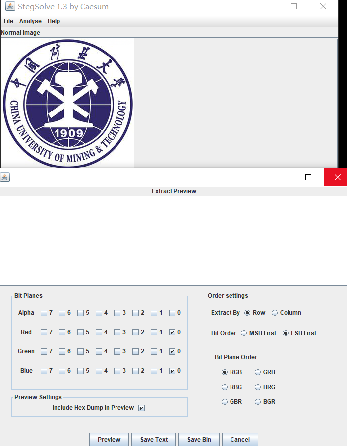
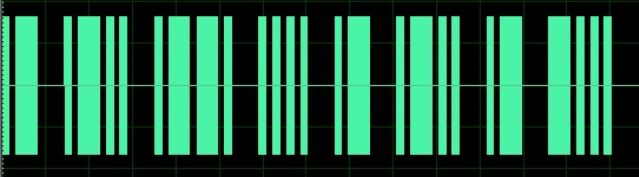
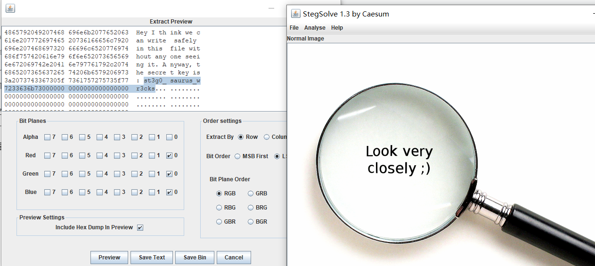

平台：https://buuoj.cn/

[TOC]

## [LSB](https://buuoj.cn/challenges#LSB) 

根据题目提示，本题与LSB有关，使用stegsolve的data st提取rgb的lsb位，并保存成二进制，得到一张图片，用QR_Search扫描得到二维码。



## Wireshark 

用wireshark打开包，分析数据，得到passward即为flag。

## [HBNIS2018]来题中等的吧  

[题目](https://buuoj.cn/challenges#[HBNIS2018]%E6%9D%A5%E9%A2%98%E4%B8%AD%E7%AD%89%E7%9A%84%E5%90%A7)



发现很像莫斯密码，短绿色为“.”，长绿色为“-”,短黑色为莫斯符分割，长黑色为字符分割符。用莫斯密码对应解密即可得到flag。

1. 另外一个世界

   

   用vscode等二进制编辑器打开图片，发现最后面有一些二进制的值，复制二进制，转换成int，再转换成16进制，最后转成字符，打印输出即可。

   ```python
   import binascii
   a = int('01101011011011110110010101101011011010100011001101110011',2)
   b = hex(a)
   c = b.split("0x")
   ans = binascii.a2b_hex(c[1])
   print(ans)
   ```

## [BJDCTF2020]鸡你太美 

篮球副本.gif缺少文件头，`GIF8`,使用notepad等编辑工具补全就可以查看该gif文件了。


即可得到flag。提交的时候将“-”换成”_”。。。

## TARGZ-y1ng  

循环解压，密码为上一级的文件名，写py脚本即可

```python
import zipfile
import sys
import os.path as op

name = 'OKMIlLVft'
while True:
    path = op.join(sys.path[0],name+'.tar.gz')
    zf = zipfile.ZipFile(path)
    zf.extractall(path = sys.path[0],pwd = bytes(name,"utf8"))
    name = zf.filelist[0].filename
    name = name.split(".tar.gz")[0]
```

## [GXYCTF2019]gakki


## 0x0F 镜子里的世界

使用stegsolve的ectract preview工具，查看RGB的LSB位，得到flag。

